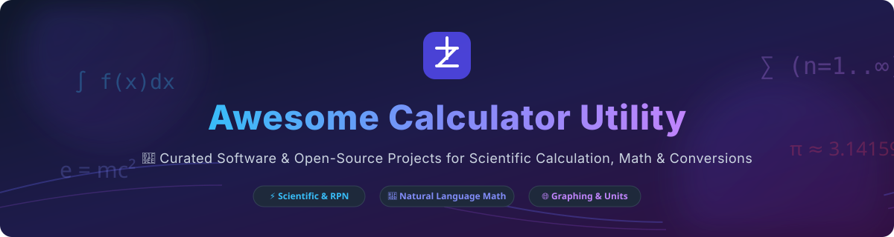

# 🧮 Awesome Calculator Utility

  
  
  
  
  

> 🚀 **Curated List of Commercial Software & Open-Source GitHub Projects**
> 
> *Focused on Scientific Calculation, Unit Conversion, Notepad-Style Math, Graphing & Symbolic Computation*
>
> **Last updated: October 2026**

---

## 💡 Overview & Market Landscape

The **global calculator and computational software market** is estimated at **$1.8B – $2.5B annually**, spanning educational graphing tools, professional financial calculators, advanced desktop scientific applications, and enterprise knowledge engines.

### 📊 Market Fragmentation Profile
* **Sector Structure**: **Moderately Fragmented** with specialized category leaders.
* **Category Dynamics**: While general consumer mobile calculator apps are commoditized, specialized sub-niches exhibit high user loyalty:
  * 📈 **Graphing & K-12 Education**: High concentration around **Desmos** and **GeoGebra**.
  * 🔬 **Symbolic & Enterprise Knowledge**: Dominates by **Wolfram Alpha**.
  * 📝 **Notepad / Natural Language Math**: Moderately fragmented across desktop apps like **Soulver**, **Numi**, **NoteCalc**, and **calced**.
  * 🔓 **Desktop Scientific & Open-Source**: Extremely healthy, mature open-source ecosystem led by **Windows Calculator**, **SpeedCrunch**, and **Qalculate!**.

---

## 📑 Table of Contents

- [💼 Commercial & SaaS Software](#-commercial--saas-software)
- [🔓 Open-Source GitHub Projects](#-open-source-github-projects)
- [🤝 How to Contribute](#-how-to-contribute)
- [⚠️ Disclaimer](#-disclaimer)
- [💖 Support](#-support)
- [📈 Star History](#-star-history)

---

## 💼 Commercial & SaaS Software

*Sorted by Company Size / Market Valuation (Descending)*

The calculator software landscape features both enterprise giants and dedicated indie studios providing specialized calculation, financial, and educational tooling.

| 🏢 Product / Company | 💰 Starting Tier Pricing | 🎁 Free Tier / Trial Limit | 📊 Company Size / Valuation | 🎯 Best For & Key Features |
| :--- | :--- | :--- | :--- | :--- |
| **[HP 12C Calculator](https://www.hp.com/us-en/shop/pdp/hp-12c-financial-calculator)** *(HP Inc. - NYSE: HPQ)* | **$69.99** one-time (Hardware / Official App) | **None** (Paid hardware/official software) | **~$29.5 Billion** Market Cap (HP Inc.) | **Finance & Real Estate**: Legendary RPN financial calculator used by banking and real estate professionals worldwide for over 40 years. |
| **[Desmos](https://www.desmos.com/)** *(Acquired by Amplify)* | **$0.00** (Free for students/teachers; enterprise API licensing) | **Unlimited Free Web & Mobile Access** (Core graphing tool is 100% free forever) | **~$250 Million+** (Acquired by Amplify; raised $10.4M VC prior) | **Students & Educators**: Industry-standard interactive graphing calculator, function visualization, regression modeling, and classroom math activities. |
| **[Wolfram Alpha](https://www.wolframalpha.com/)** *(Wolfram Research)* | **$9.95/month** (Pro plan; API starting at $25/mo) | **Free Web Queries** (Limited step-by-step solutions & file uploads) | **~$100 Million+** Annual Revenue (Private; estimated valuation ~$500M-$1B) | **Scientists & Engineers**: Premier computational knowledge engine providing symbolic math, step-by-step solutions, differential equations, and data analytics. |
| **[Soulver](https://soulver.app/)** *(Acqualia)* | **$59.00** one-time license | **30-Day Fully Functional Free Trial** | **Indie Studio** (~$500K-$1M Revenue) | **Mac & iOS Power Users**: The original notepad calculator that turns plain English text into live calculations with live currency and stock data. |
| **[PCalc](https://pcalc.com/)** *(TLA Systems)* | **$9.99** one-time (Universal iOS/macOS) | **PCalc Lite Available** (Free stripped-down version with optional feature in-app purchases) | **Indie Studio** (~$200K-$500K Revenue) | **Apple Platform Power Users**: Highly customizable scientific calculator with RPN mode, programmable functions, unit conversions, and Apple Watch support. |
| **[Numi](https://numi.app/)** *(Indie)* | **$14.99/month** (via Setapp bundle) or **$19.99** standalone license | **Free Basic Download** (Occasional upgrade prompts / basic mode free) | **Indie Studio** (<$200K Revenue) | **macOS Developers & Analysts**: Elegant notepad calculator supporting natural language math, time zone math, currency conversion, and custom JS plugins. |
| **[Calcbot](https://tapbots.com/calcbot/)** *(Tapbots)* | **$1.99/year** (Calcbot Pro subscription) | **Free Basic Calculator & History** (Pro features like unit conversion locked) | **Indie Studio** (<$200K Revenue) | **iOS & Apple Watch Users**: Clean, beautifully designed standard calculator with interactive calculation history tape and quick conversion. |
| **[HiPER Scientific Calculator](https://hiperlabs.eu/)** *(HiPER Development)* | **$5.99** one-time (Pro Version) | **Free Ad-Supported Version** (Core scientific features included free) | **Indie Studio** (<$100K Revenue) | **Android & Windows Users**: Comprehensive scientific calculator with multi-line display, symbolic algebra, matrix math, and custom color themes. |

---

## 🔓 Open-Source GitHub Projects

*Sorted by GitHub Star Count (Descending)*

The open-source ecosystem for calculators is exceptionally vibrant, offering production-grade tools ranging from Windows' official calculator to arbitrary-precision symbolic engines and WASM notepad tools.

| 📦 Project & Repository | ⭐ Star Count | 📜 License | 🖥️ Supported Platforms | ⚡ Primary Highlight & Focus |
| :--- | :--- | :--- | :--- | :--- |
| **[Windows Calculator](https://github.com/Microsoft/calculator)** |  | **MIT** | Windows 11 / C++ | **Official Windows Calculator**: Includes Standard, Scientific, Programmer, Date Calculation, and real-time Unit & Currency conversion. |
| **[Uno Calculator](https://github.com/unoplatform/calculator)** |  | **MIT** | iOS, Android, macOS, Linux, WebAssembly | **Cross-Platform C# Port**: Official C# / Uno Platform port of Microsoft's Windows Calculator bringing the desktop UI to mobile and web. |
| **[Qalculate! (libqalculate)](https://github.com/Qalculate/libqalculate)** |  | **GPL-2.0** | Linux, Windows, macOS (Qt/GTK/CLI) | **Most Feature-Dense Scientific Calculator**: Arbitrary precision, symbolic algebra, dimensional unit analysis, currency exchange, and extensive physics constants. |
| **[GeoGebra](https://github.com/geogebra/geogebra)** |  | **GPL-3.0** | Web, Windows, macOS, Linux, Android, iOS | **Dynamic Mathematics Suite**: Combines geometry, algebra, spreadsheets, graphing, statistics, and calculus in one interactive package. |
| **[NoteCalc](https://github.com/bbodi/notecalc3)** |  | **MIT** | Browser (Rust / WASM), Docker | **Browser Notepad Calculator**: Soulver alternative built with Rust and WebAssembly, evaluating math expressions, user functions, and unit math live in your browser. |
| **[Fossify Calculator](https://github.com/FossifyOrg/Calculator)** |  | **GPL-3.0** | Android (Kotlin) | **Privacy-First Mobile Calculator**: Ad-free, offline Android calculator with zero internet permissions, customizable theme colors, and history tape. |
| **[SpeedCrunch](https://github.com/speedcrunch/SpeedCrunch)** |  | **GPL-2.0** | Windows, macOS, Linux (Qt) | **Keyboard-Driven Desktop Scientific App**: High precision, syntax-highlighted scrollable display, auto-completion, built-in formula book, and quick constants insertion. |
| **[KCalc](https://github.com/KDE/kcalc)** |  | **GPL-2.0** | Linux (KDE Plasma) | **KDE Desktop Calculator**: Reliable scientific calculator with trigonometric functions, logical operations, statistical calculations, and stack manipulation. |
| **[GNOME Calculator](https://github.com/GNOME/gnome-calculator)** |  | **GPL-3.0** | Linux (GNOME) | **Official GNOME Desktop Calculator**: Modern GTK4 app with Basic, Advanced, Financial, and Programmer modes plus monetary unit conversions. |
| **[calced](https://github.com/calced/calced)** |  | **MIT** | Cross-platform CLI (Python / HTML) | **Plain-Text Notepad Math Engine**: Single-file zero-dependency Python CLI and HTML web app evaluating inline math, variables, unit conversions, and percentage rates in text files. |

---

## 🤝 How to Contribute

Contributions are highly appreciated! To submit a new calculator utility or update an existing entry:

1. 🍴 **Fork** this repository.
2. 📝 **Add or update** entries in `README.md` keeping the Markdown tabular formatting consistent.
3. 🔗 Include official product/repository links, factual pricing or GitHub star links, and key highlights.
4. 🚀 **Submit a Pull Request** with a brief summary of changes.

---

## ⚠️ Disclaimer

- This repository is a community-curated collection intended for educational and informational reference.
- Product prices, enterprise valuations, and GitHub star counts reflect publicly available estimates and are subject to change.
- Always review privacy practices when using cloud-based calculator services for sensitive financial or proprietary calculations.

---

## 💖 Support

If you find this repository helpful, please consider showing your support:

- ⭐ **Star** this repository to increase its visibility on GitHub!
- 🔀 **Fork** it to contribute improvements or save your own list.
- 📢 **Share** it with fellow developers, students, and researchers.
- ☕ **Sponsor / Buy me a coffee**: If you'd like to support open-source curation and development, consider sponsoring via the [Sponsor Dashboard](https://github.com/sponsors/ishandutta2007).

---

## 📈 Star History

